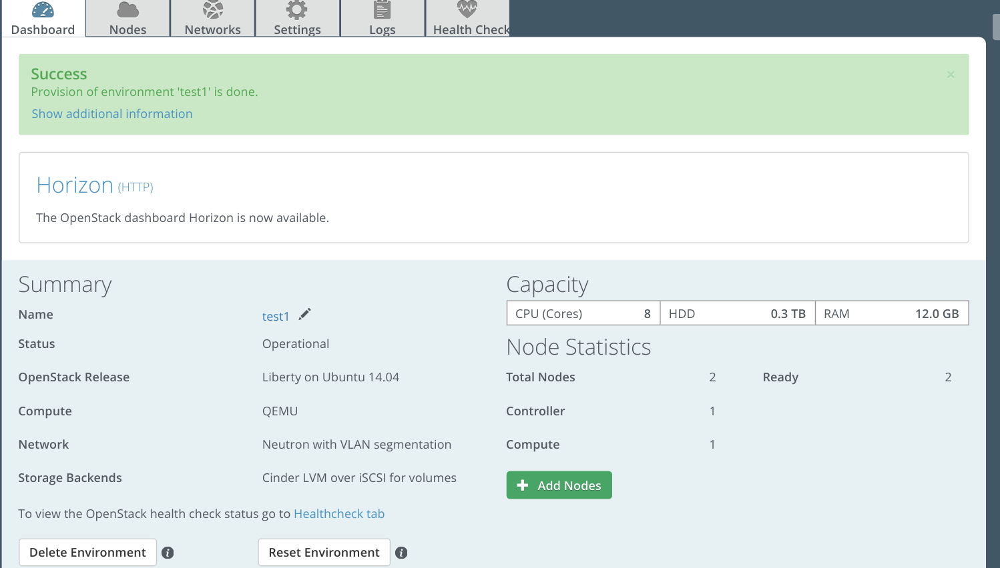
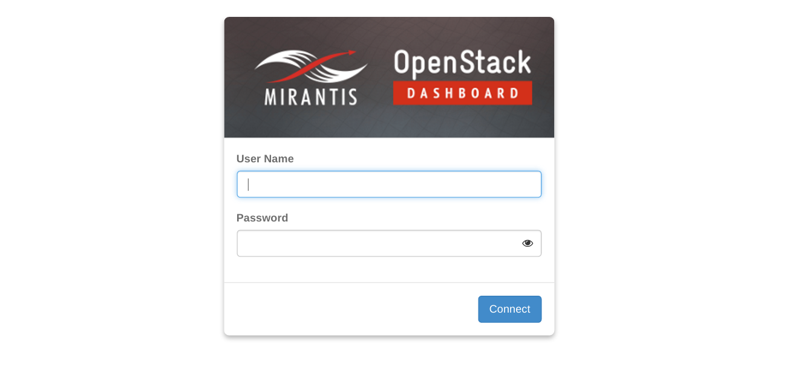
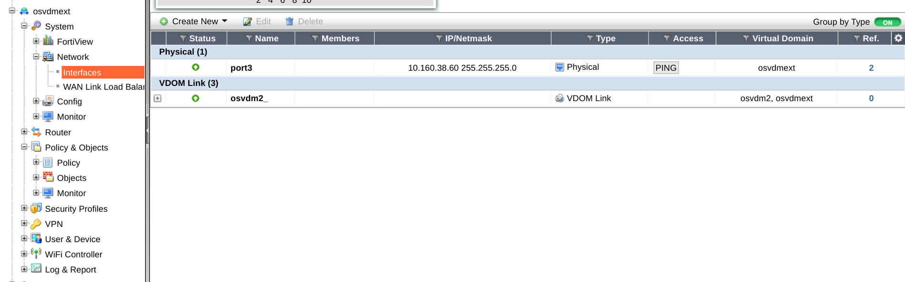

.. _user_guide:

User Guide
==========

.. _plugin_configuration:

Plugin configuration
--------------------

#. `Create a new environment with the Fuel UI wizard. <http://docs.openstack.org/developer/fuel-docs/userdocs/fuel-user-guide/create-environment/start-create-env.html>`_
   At the moment only the Ubuntu distribution is supported.

     .. image:: _static/create_env1.png
        :alt: Create a liberty OpenStack environment

     .. image:: _static/create_env2.png
        :alt: Select qemu-kvm as hypervisor

     .. image:: _static/create_env3.png
        :alt: Select VLAN segmentation for tenant network

   Select the desired storage backends and additional services.
    
#. `Add nodes to the environment and assign roles. <http://docs.openstack.org/developer/fuel-docs/userdocs/fuel-user-guide/configure-environment/add-nodes.html>`_

#. `Modify networking configurations. <http://docs.openstack.org/developer/fuel-docs/userdocs/fuel-user-guide/configure-environment/network-settings.html>`_

     .. image:: _static/networking_default.png
        :alt: Modify public/storage/management network settings in default network group.

     .. image:: _static/networking_ml2.png
        :alt: Modify ml2 vlan related configuration.

     .. image:: _static/networking_l3.png
        :alt: Modify floating IP pool.

#. Configure FortiGate Connector settings.
   Click on Other on navigation bar and scroll down to "Fuel plugin to deploy FortiGate ML2 plugin on OpenStack".
   Click on the checkbox for the Fortinet fuel plugin and change related settings.

     .. image:: _static/networking_fortinet.png
        :alt: Modify FortiGate related settings.

#. Click *Save Settings* at the bottom of the page to save the configuration parameters.

#. Switch to the *Nodes* tab and assign different networks to the interfaces.

     .. image:: _static/nodes_interface1.png

     .. image:: _static/nodes_interface2.png

#. Select the *Networks* tab, scroll to the bottom, and `Verify Networks <http://docs.openstack.org/developer/fuel-docs/userdocs/fuel-user-guide/configure-environment/verify-networks.html>`_.

#. Then finally, `Deploy Changes <http://docs.openstack.org/developer/fuel-docs/userdocs/fuel-user-guide/deploy-environment.html>`_.

.. _plugin_install_verification:

Plugin Install Verification
---------------------------

Once the deployment is finished, the Dashboard tab will display the "Success" notification, stating that
the plugin is deployed and a link with name HTTP will be displayed.

Click on *HTTP* and it will lead you to OpenStack dashboard.

When Neutron service starts, it will use the FortiGate Connector to initialize the FortiGate and create a VDOM called osvdmext.
You can log onto FortiGate to check whether the VDOM has been created.

Using FortiGate Connector
-------------------------

For instructions on using the FortiGate Connector, please refer to the official admin guide on `Fortinet support site <http://support.fortinet.com>`_.
The operations are transparent to the OpenStack users and the FortiGate connector will configure the FortiGate via RestFul API when networks, subnets, routers and firewalls are created on OpenStack.
